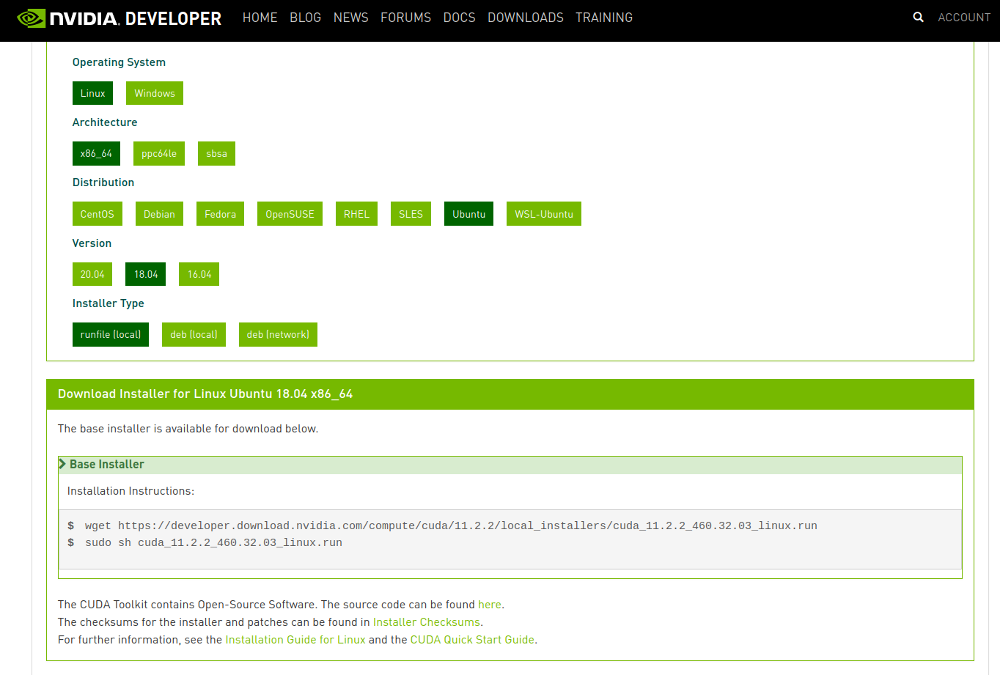
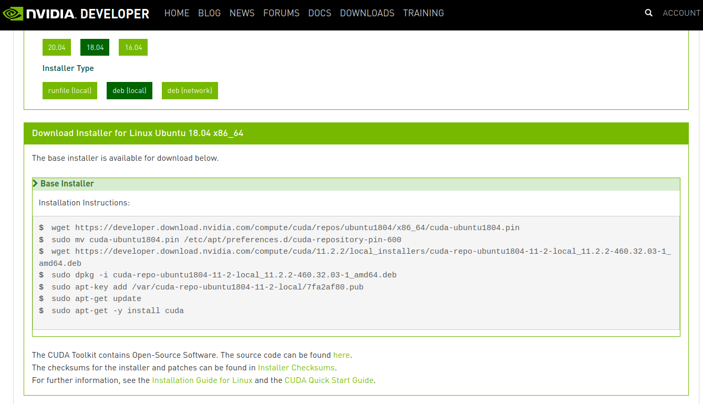
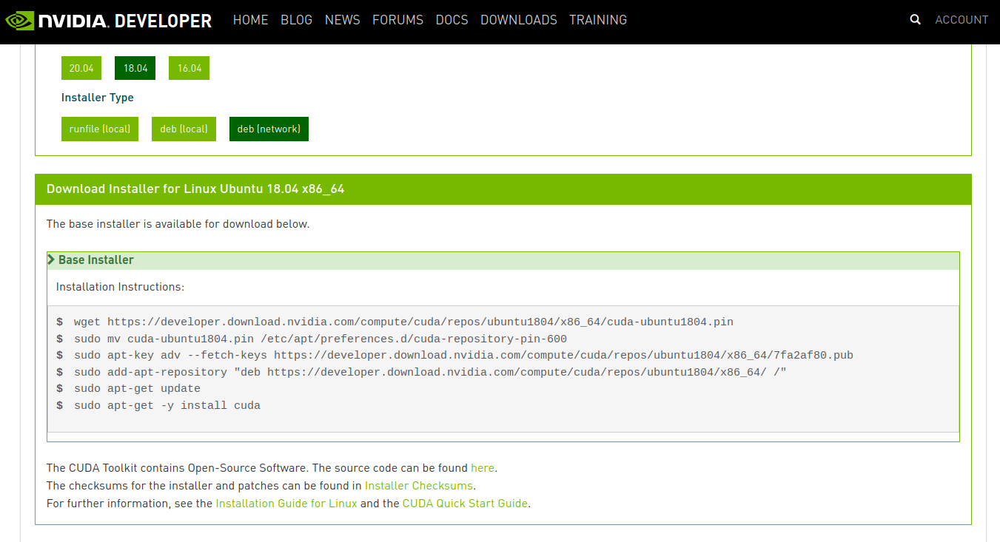
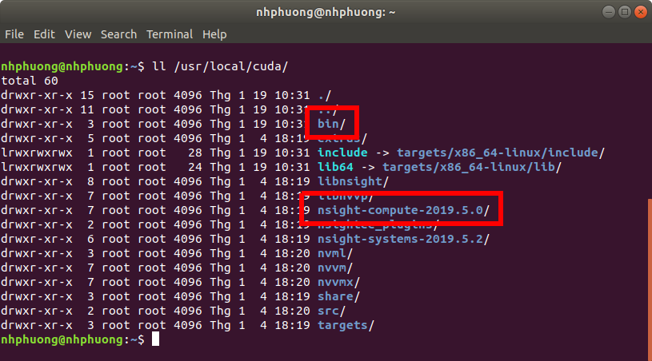
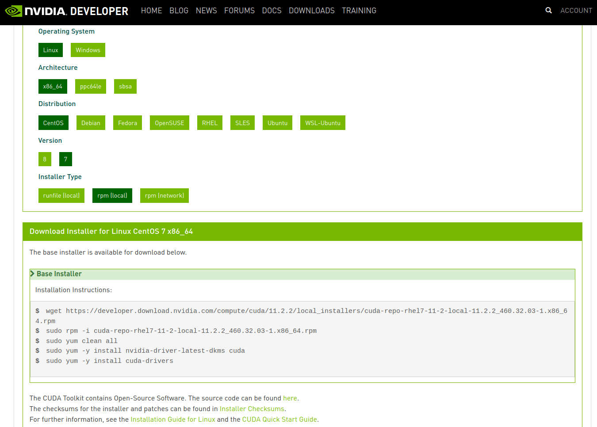
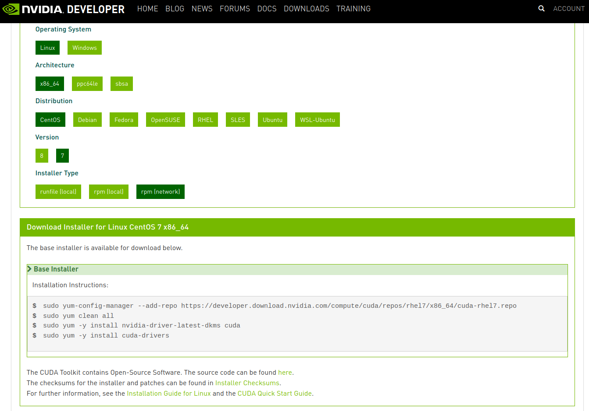
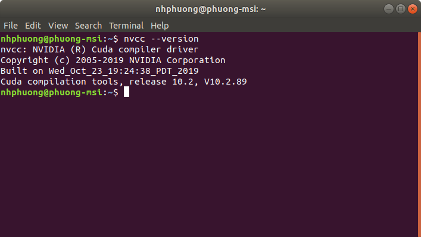
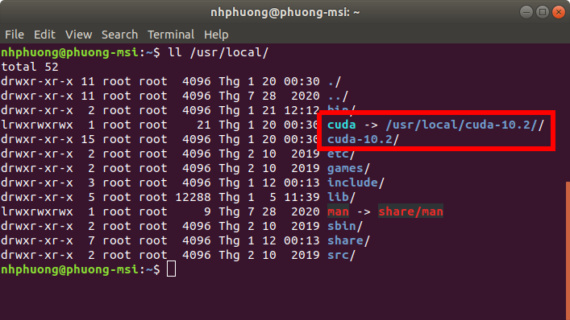

# How to install nvidia CUDA Toolkit on Linux system
Source: https://docs.nvidia.com/cuda/cuda-installation-guide-linux/index.html

All version doc: https://developer.nvidia.com/cuda-toolkit-archive

Download: http://developer.nvidia.com/cuda-downloads

> **_NOTE 1:_** this guide is best for installing from fresh (no previous installation) & support install multiple version of cuda toolkit

> **_NOTE 2:_** we can install multiple version of cuda toolkit on the same system but can only run one of them at a time. A tip for switching between different versions is mentioned below

## Table of contents
- [Pre-installation steps](#Pre-installation-steps)
- [Ubuntu 18.04](#Ubuntu-18.04)
    - [Method 1 (runfile)](#Method-1-runfile)
    - [Method 2 (using pakage manager offline)](#Method-2-using-pakage-manager-offline)
    - [Method 3 (using pakage manager online)](#Method-3-using-pakage-manager-online)
    - [Post-installation steps](#Post-installation-steps)
        - [Configure symlink for cuda toolkit version](#Configure-symlink-for-cuda-toolkit-version)
        - [Configure PATH](#Configure-PATH)
        - [Configure LD_LIBRARY_PATH](#Configure-LD_LIBRARY_PATH)
- [CentOS 7](#CentOS-7)
    - [Method 1 (runfile)](#Method-1-runfile-1)
    - [Method 2 (using pakage manager offline)](#Method-2-using-pakage-manager-offline-1)
    - [Method 3 (using pakage manager online)](#Method-3-using-pakage-manager-online-1)
    - [Post-installation steps](#Post-installation-steps-1)
        - [Configure symlink for cuda toolkit version](#Configure-symlink-for-cuda-toolkit-version-1)
        - [Configure PATH](#Configure-PATH-1)
        - [Configure LD_LIBRARY_PATH](#Configure-LD_LIBRARY_PATH-1)
- [Checking installation](#Checking-installation)

## Pre-installation steps
__Step 1:__ [Install nvidia driver](../driver)

__Step 2:__ Check for maximum supported cuda toolkit version according to installed driver
```sh
nvidia-smi
```
> Ex:


> any cuda toolkit version <= 11.2 is compatiple with current system

## Ubuntu 18.04
### Method 1 (runfile)
__Step 1:__ Download cuda toolkit runfile (version according to above pre-installation steps) from nvidia websites

__Step 2:__ Go to download folder & run the installation file

> **_NOTE_**: Remember to exclude driver installation included in the runfile
```sh
sudo sh <runfile>.run
```


### Method 2 (using pakage manager offline)
Follow instruction on download page


### Method 3 (using pakage manager online)
Follow instruction on download page


### Post-installation steps
#### Configure symlink for cuda toolkit version
Create symlink from `/usr/local/cuda` to `/usr/local/cuda-<version>` (remove existing cuda symlink if necessary)
```sh
sudo ln -s /usr/local/cuda-<version> /usr/local/cuda
```
> **_NOTE:_** This is also used for switching between version of cuda toolkit

#### Configure PATH
Check the name of `nsight-compute` in cuda toolkit installed directory


Modify & add these lines accordingly to `~/.bashrc` or `~/.profile` (for local users) or `/etc/profile` (for system-wide users) & restart terminal/OS
```sh
if [ -d "/usr/local/cuda/bin/" ]; then
    export PATH=/usr/local/cuda/bin:/usr/local/cuda/nsight-compute-<version>${PATH:+:${PATH}}
fi
```
#### Configure LD_LIBRARY_PATH
Add `/usr/local/cuda/lib64` to `/etc/ld.so.conf.d/<cuda_config>.conf` file and run `ldconfig` as root
```sh
sudo bash -c "echo /usr/local/cuda/lib64 > /etc/ld.so.conf.d/cuda.conf"
sudo ldconfig
```
> **_NOTE:_** Later version of cuda toolkit installer has done this so no need to (`/etc/ld.so.conf.d/cuda-11-4.conf`)

## CentOS 7
### Method 1 (runfile)
Same as [runfile](#Method-1-(runfile)) on Ubuntu

### Method 2 (using pakage manager offline)
Follow instruction on download page


> **_NOTE:_** Remove `nvidia-driver-latest-dkms` since driver has been installed

### Method 3 (using pakage manager online)
Follow instruction on download page


> **_NOTE:_** Remove `nvidia-driver-latest-dkms` since driver has been installed

### Post-installation steps
#### Configure symlink for cuda toolkit version
Same as [ubuntu version](#Configure-symlink-for-cuda-toolkit-version)

#### Configure PATH
Add file `<cuda_PATH_conf>.sh` to /etc/profile.d/ with below content

```sh
if [ -d "/usr/local/cuda/bin/" ]; then
    pathmunge /usr/local/cuda/bin
    pathmunge /usr/local/cuda/nsight-compute-<version>
fi
```

#### Configure LD_LIBRARY_PATH
Same as [ubuntu version](#Configure-LD_LIBRARY_PATH)

## Checking installation
Run below command to check for installed & running version:

```sh
nvcc --version
```


```sh
ll /usr/local/
```

> A symlink created to re-direct any access to cuda to current in-use version
