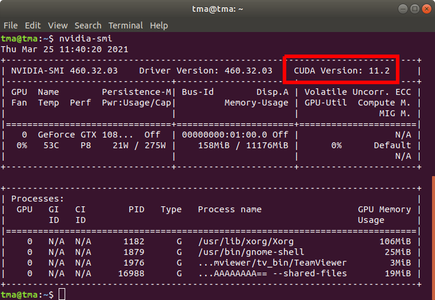
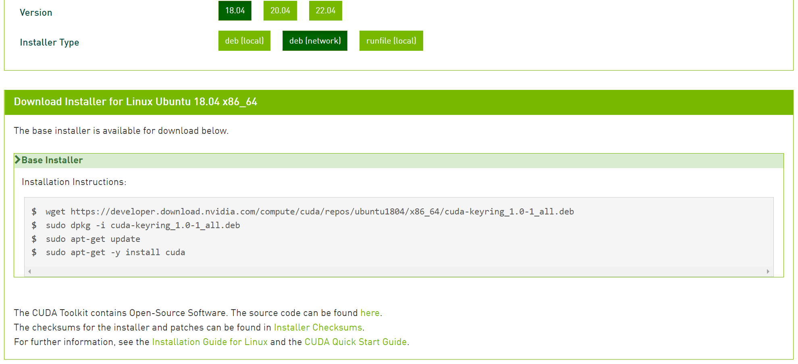

# How to install nvidia CUDA Toolkit on Linux system
Source https://docs.nvidia.com/cuda/cuda-installation-guide-linux/index.html

Download http://developer.nvidia.com/cuda-downloads

**NOTE 1:** this guide is best for installing from fresh (no previous installation) & support install multiple version of cuda toolkit

**NOTE 2:** we can install multiple version of cuda toolkit on the same system but can only run one of them at a time. A tip for switching between different versions is mentioned below

## Pre-installation steps
Step 1: [Install nvidia driver](../driver)

Step 2: Check for maximum supported cuda toolkit version according to installed driver
```sh
nvidia-smi
```
Ex:

=> any cuda toolkit version <= 11.2 is compatiple with current system

## Ubuntu 18.04
### Method 1 (runfile)
Step 1: Download cuda toolkit runfile (version according to above pre-installation steps) from nvidia websites

Step 2: Go to download folder & run the installation file

**NOTE**: Remember to exclude driver installation included in the runfile
```sh
sudo sh <runfile>.run
```


### Method 2 (using pakage manager offline)
Follow instruction on download page


### Method 3 (using pakage manager online)
Follow instruction on download page


## Post-installation steps
### Configure symlink for cuda toolkit version
Create symlink from `/usr/local/cuda` to `/usr/local/cuda-<version>` (rm existing symlink cuda if necessary)
```sh
sudo ln -s /usr/local/cuda-<version> /usr/local/cuda
```
**NOTE:** This is also used for switching between version of cuda toolkit

### Configure PATH
Modify & add these lines to `~/.bashrc` or `~/.profile` & restart terminal/OS

```sh
if [ -d "/usr/local/cuda/bin/" ]; then
    export PATH=/usr/local/cuda/bin:/usr/local/cuda/nsight-compute-<version>${PATH:+:${PATH}}
fi
```
### Configure LD_LIBRARY_PATH
add `/usr/local/cuda/lib64` to `/etc/ld.so.conf.d/<cuda_config>.conf` file and run `ldconfig` as root
```sh
sudo bash -c "echo /usr/local/cuda/lib64 > /etc/ld.so.conf.d/cuda.conf"
sudo ldconfig
```

## CentOS 7
### Method 1 (runfile)

### Method 2 (using pakage manager offline)

### Method 3 (using pakage manager online)
