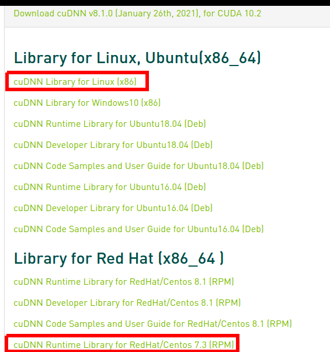

# How to install nvidia CUDNN on Linux system
> This guide only follow guideline for installation using tar file

Source: https://docs.nvidia.com/deeplearning/cudnn/install-guide/index.html

All versions: https://docs.nvidia.com/deeplearning/cudnn/archives/index.html

Download: https://developer.nvidia.com/rdp/cudnn-download

or

https://developer.nvidia.com/rdp/cudnn-archive

## For both Ubuntu & CentOS
### Download & extract tar file
__Step 1:__ Go to download page & download cudnn version which is compatible with targeted TensorRT & installed cuda toolkit version

> **Hint:** Go to installation document of [TensorRT](../tensorRT) & look for dependencies list


Select library type according to installed OS



Go to download folder & extract file

```sh
tar -xzvf <cudnn_file>.tgz
```

> From here we refer to extracted folder as `<cudnn_dir>` 

__Step 2:__ Copy cudnn lib to installed cuda toolkit folder
```sh
sudo cp <cudnn_dir>/include/cudnn*.h /usr/local/cuda/include
sudo cp -P <cudnn_dir>/lib64/libcudnn* /usr/local/cuda/lib64
sudo chmod a+r /usr/local/cuda/include/cudnn*.h /usr/local/cuda/lib64/libcudnn*
```

__Step 3:__ Check for completion
```sh
ll /usr/local/cuda/lib64/
```
