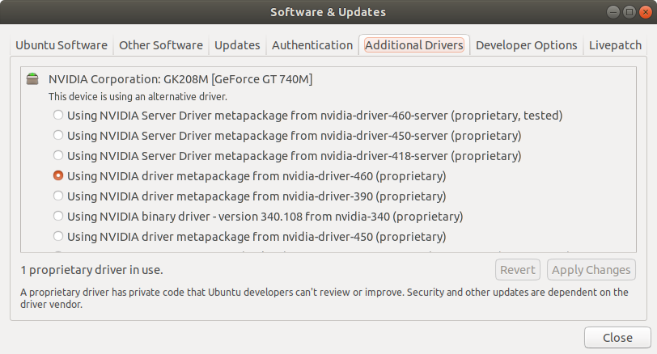
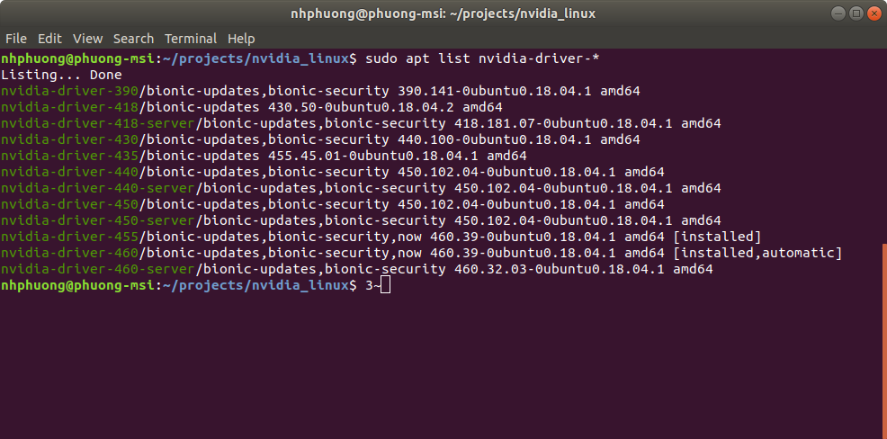

# How to install nvidia driver on Linux system
Source: https://docs.nvidia.com/cuda/cuda-installation-guide-linux/index.html#driver-installation

&

https://docs.nvidia.com/datacenter/tesla/tesla-installation-notes/index.html

All version: https://www.nvidia.com/Download/Find.aspx

Download: https://www.nvidia.com/Download/index.aspx

## Table of contents
- [Ubuntu 18.04](#Ubuntu-18.04)
    - [Method 1 (easiest)](#Method-1-easiest)
    - [Method 2 (using pakage manager)](#Method-2-using-pakage-manager)
    - [Method 3 (manually)](#Method-3-manually)
        - [Pre-installation Actions](#Pre-installation-Actions)
        - [Installation steps](#Installation-steps)
- [CentOS 7](#CentOS-7)
    - [Pre-installation Actions](#Pre-installation-Actions)
    - [Method 1 (using pakage manager)](#Method-1-using-pakage-manager)
    - [Method 2 (manually)](#Method-2-manually)

## Ubuntu 18.04
### Method 1 (easiest)
Select available driver from Software & Updates application



### Method 2 (using pakage manager)
__Step 1:__ List out all available nvidia drivers
```sh
sudo apt update
sudo apt list nvidia-driver-*
```

__Step 2:__ Choose one of the list of available drivers & install

```sh
sudo apt install nvidia-driver-<branch>
```

### Method 3 (manually)
#### Pre-installation Actions
__Step 1:__ Disable the Nouveau drivers

_ Create a file at /etc/modprobe.d/blacklist-nouveau.conf with the following contents:
```cfg
blacklist nouveau
options nouveau modeset=0
```
Quick cmd
```sh
sudo bash -c "echo blacklist nouveau > /etc/modprobe.d/blacklist-nvidia-nouveau.conf"
sudo bash -c "echo options nouveau modeset=0 >> /etc/modprobe.d/blacklist-nvidia-nouveau.conf"
```
_ Regenerate the kernel initramfs:
```sh
sudo update-initramfs -u
```

__Step 2:__ Download & Calculate the MD5 checksum of the downloaded file

```sh
md5sum <file>
```

__Step 3:__ Install kernel headers & necessary packages

```sh
sudo apt install linux-headers-$(uname -r) libglvnd-dev pkg-config dkms
```

__Step 4:__ Uninstall old installation

Depend on the way the previous nvidia driver was installed, unistall it using one of below methods:

_ For installing using pkg manager
```sh
sudo apt remove nvidia-driver-<branch>
```

_ For installing using *.run file
```sh
sudo ./<driver_file>.run --uninstall
```

#### Installation steps
__Step 1:__ Reboot and login to virtual console (tty) by pressing `ctrl + alt + F2/.../F6`

__Step 2:__ Go to the directory which contains downloaded drivers & run the *.run file (with options if necessary. Ex: `--dkms`)
```sh
sudo ./<driver_file>.run --dkms
```

> **_NOTE:_** See [here](./OptionToInstallNvidiaDriver.txt) for list of avalable options

> **_NOTE:_** For more instruction from nvidia, see [here](./READMEtext.txt)

## CentOS 7
### Pre-installation Actions
__Step 1:__ Install necessary packages
```sh
sudo dnf install -y tar bzip2 make automake gcc gcc-c++ pciutils elfutils-libelf-devel libglvnd-devel iptables firewalld vim bind-utils wget
```

__Step 2:__ Install kernel headers
```sh
sudo yum install kernel-devel-$(uname -r) kernel-headers-$(uname -r)
```

__Step 3:__ Uninstall old installation

Depend on the way the previous nvidia driver was installed, unistall it using one of below methods:

_ For installing using pkg manager
```sh
sudo yum remove nvidia-driver-latest-dkms
```

_ For installing using *.run file
```sh
sudo ./<driver_file>.run --uninstall
```

### Method 1 (using pakage manager)
__Step 1:__ Satisfy the external dependency on EPEL for DKMS
```sh
sudo yum install -y https://dl.fedoraproject.org/pub/epel/epel-release-latest-7.noarch.rpm
```

__Step 2:__ Install the CUDA repository public GPG key
```sh
distribution=rhel7
ARCH=$( /bin/arch )
sudo yum-config-manager --add-repo http://developer.download.nvidia.com/compute/cuda/repos/$distribution/${ARCH}/cuda-$distribution.repo
```

__Step 3:__ Update the repository cache and install the driver using the nvidia-driver-latest-dkms meta-package
```sh
sudo yum clean expire-cache
sudo yum install -y nvidia-driver-latest-dkms
```

### Method 2 (manually)
__Step 1:__ Download & Calculate the MD5 checksum of the downloaded file
```sh
md5sum <driver_file>
```

__Step 2:__ Disable the Nouveau drivers

_ Create a file at /etc/modprobe.d/blacklist-nouveau.conf with the following contents:
```cfg
blacklist nouveau
options nouveau modeset=0
```
_ Regenerate the kernel initramfs:
```sh
sudo dracut --force
```

__Step 3:__ Go to the directory which contains downloaded drivers & run the *.run file (with options if necessary. Ex: `--dkms`)
```sh
sudo ./<driver_file>.run
```

## NOTES
For notebook, to utilize nvidia GPU for all graphic applications, remember to change PRIME profiles to `NVIDIA (Performance Mode)`
<p align="center">
    
</p>

Alternative method is cmd `sudo prime-select (nvidia|intel|on-demand|query)`
