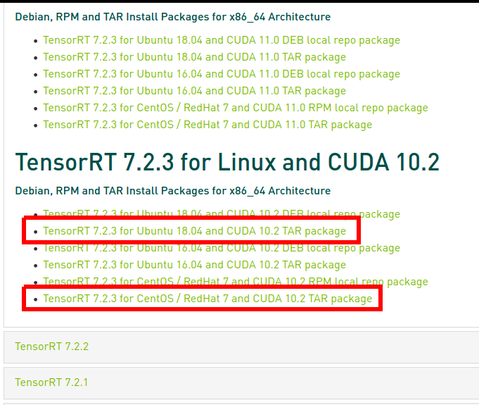

# How to install nvidia TensorRT on Linux system

> This guide only follow guideline for installation using tar file

Source: https://docs.nvidia.com/deeplearning/tensorrt/install-guide/index.html

All version: https://docs.nvidia.com/deeplearning/tensorrt/archives/index.html

Download: https://developer.nvidia.com/nvidia-tensorrt-download

## For both Ubuntu & CentOS
### Download & extract tar file
__Step 1:__ Go to download page & download TensorRT version which is compatible with installed cuda toolkit version



__Step 2:__ Unpack tar file

Unpack the tar file
```sh
tar xzvf <tensorRT tar file>.tar.gz
```

Extracted content is stored in folder `TensorRT-<version>`

### Setup TensorRT permanent directory

__Step 1:__ Create directory to store multiple version of tensorRT
```sh
cd ~
mkdir packages && cd packages
```

__Step 2:__ Move all folder `TensorRT-<version>` to `~/packages`
```sh
mv -f <path_to_trt_dir>/TensorRT-<version> .
```

__Step 3:__ Create symlink for TensorRT
```sh
ln -s TensorRT-<version> TensorRT
```
> **_NOTE:_** The method for switching between multiple version of TensorRT is the same as cuda toolkit -> modify symlink file

### Add TensorRT to LD_LIBRARY_PATH
Add `TensorRT/lib` to `/etc/ld.so.conf.d/<trt_config>.conf` file and run `ldconfig` as root
```sh
sudo bash -c "echo /home/<user>/packages/TensorRT/lib > /etc/ld.so.conf.d/trt_config.conf"
sudo ldconfig
```

### Install tensorRT pre-built python modules

Go to below sub-folders to install pre-built python module (in accordance with python version)
```sh
TensorRT-${version}/python
TensorRT-${version}/uff
TensorRT-${version}/graphsurgeon
TensorRT-${version}/onnx_graphsurgeon
```

> **_NOTE:_** For venv, please repeat this step after venv activation to install trt modules to venv
